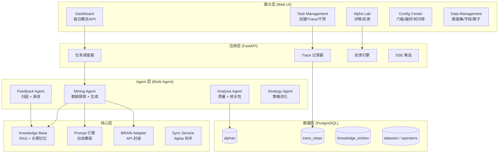
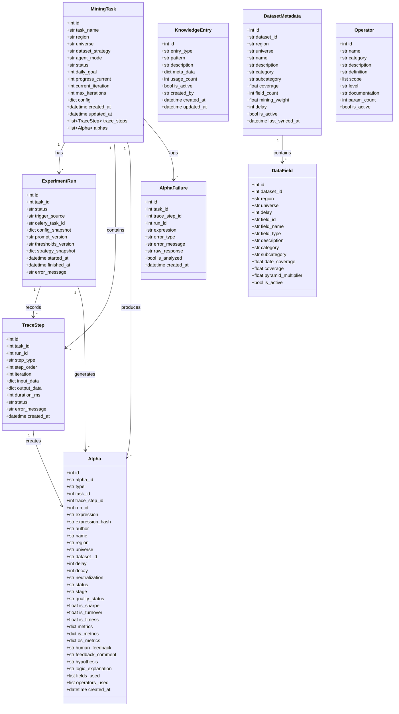
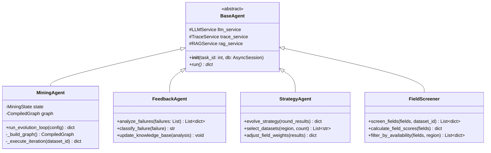
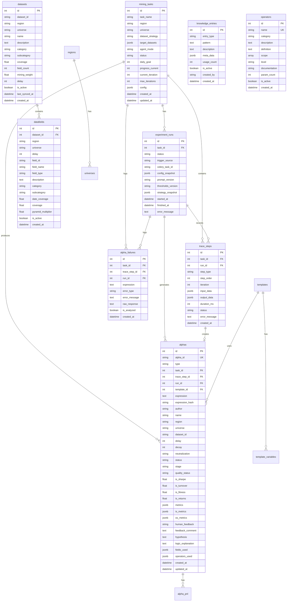
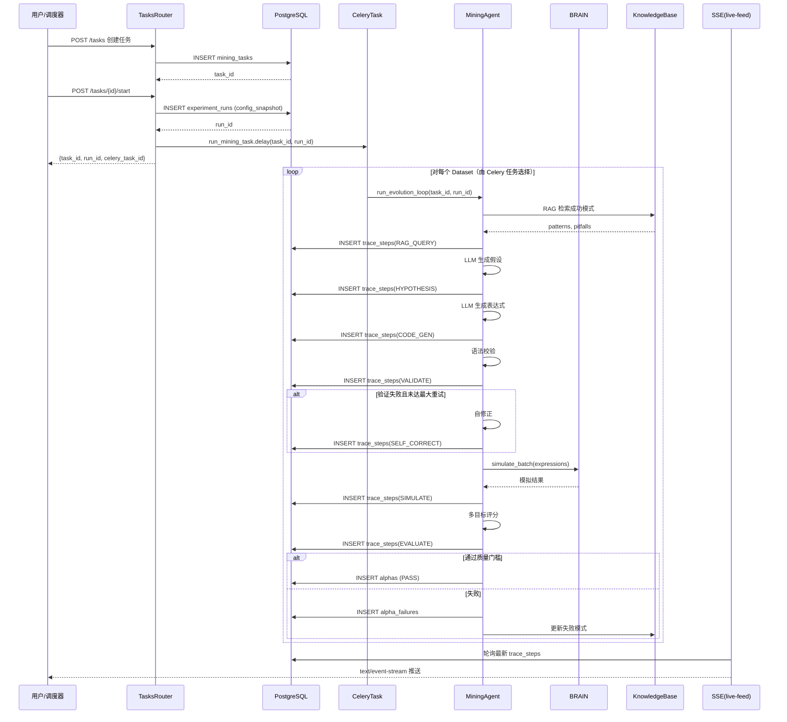
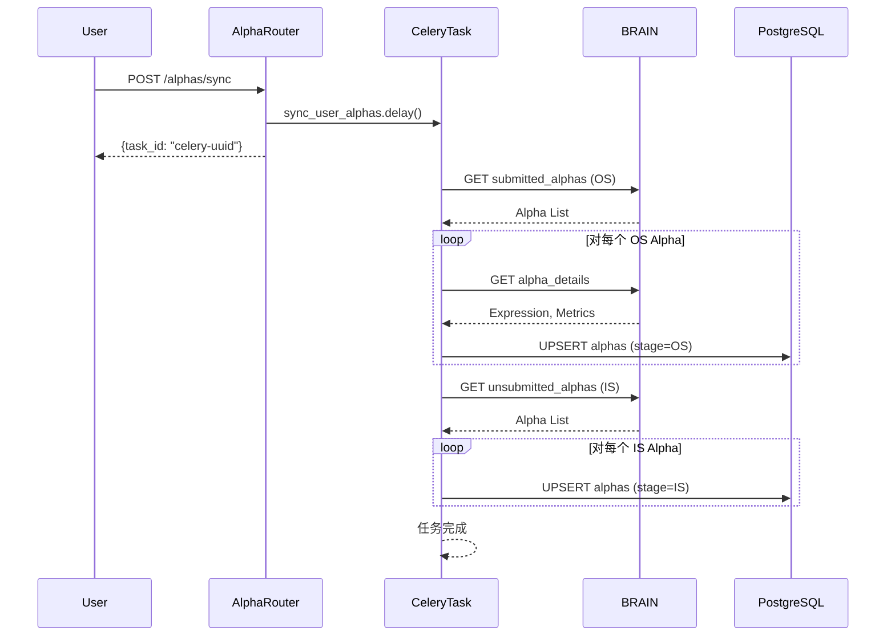
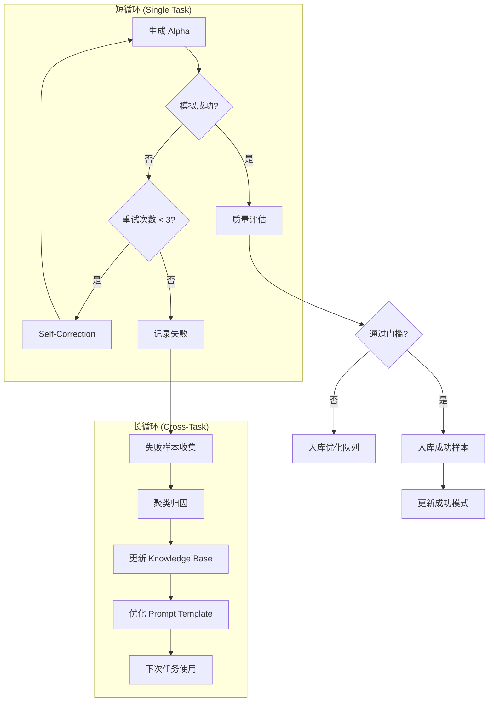
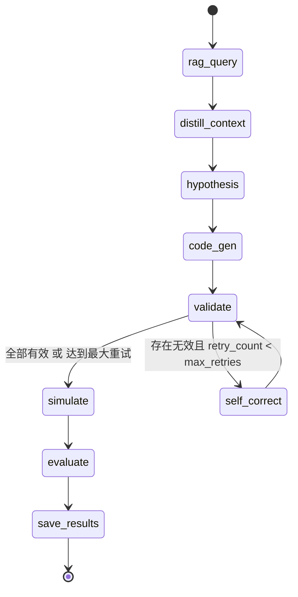

# AIAC 2.0 (AIACV2): 详细设计说明文档

**版本**：v2.2  
**日期**：2026-01-31  
**依赖文档**：需求说明文档 v2.0  
**设计理念**：Alpha-GPT + RD-Agent CoSTEER  
**文档规范**：阿里巴巴软件工程详细设计规范

---

## 目录

- [1. 系统架构设计](#1-系统架构设计)
- [2. 类设计](#2-类设计)
- [3. 接口设计](#3-接口设计)
- [4. 数据库设计](#4-数据库设计)
- [5. 核心流程详细设计](#5-核心流程详细设计)
- [6. Agent设计详情](#6-agent设计详情)
- [7. 技术选型](#7-技术选型)
- [8. 测试设计](#8-测试设计)
- [9. 附录](#9-附录)

---

## 1. 系统架构设计

### 1.1 分层架构

系统采用 **模块化单体 (Modular Monolith)** 架构，深度融合 Alpha-GPT 的交互范式与 RD-Agent 的 CoSTEER 反馈闭环。



### 1.2 核心模块职责

| 模块 | 职责 | 技术实现 |
|------|------|---------|
| **Web UI** | 人机交互界面，Trace 可视化，人工干预 | React + Ant Design + Recharts |
| **Task Scheduler** | 每日计划生成，任务分发 | Celery Beat |
| **Trace Recorder** | 记录每个挖掘步骤，支持回放 | PostgreSQL + SSE |
| **Agent Hub** | 协调 Mining/Analysis/Feedback Agent | LangGraph + 自研 |
| **Knowledge Base** | 成功模式/失败教训/元数据存储 | PostgreSQL + RAG |
| **Prompt Engine** | Prompt 构建与模板注册 | Python Prompt Builders |
| **BRAIN Adapter** | WorldQuant API 封装，限流，重试 | httpx + tenacity |
| **Sync Service** | 定期同步 Brain 平台现有 Alpha 数据 | Celery Task |

---

## 2. 类设计

### 2.1 领域模型类图



### 2.2 核心实体类详细设计

#### 2.2.1 MiningTask（挖掘任务）

**类描述**：表示一个 Alpha 挖掘任务的配置和状态。

| 属性名 | 类型 | 约束 | 描述 |
|--------|------|------|------|
| id | Integer | PK, Auto | 主键 |
| task_name | String(255) | NOT NULL | 任务名称 |
| region | String(50) | NOT NULL | 市场区域 (USA/CHN/KOR/...) |
| universe | String(100) | NOT NULL | 股票池 (TOP3000/TOP500/...) |
| dataset_strategy | String(50) | DEFAULT 'AUTO' | 数据集选择策略 |
| target_datasets | JSONB | DEFAULT [] | 指定数据集列表 |
| agent_mode | String(50) | DEFAULT 'AUTONOMOUS' | Agent 运行模式 |
| status | String(50) | DEFAULT 'PENDING' | 任务状态 |
| daily_goal | Integer | DEFAULT 4 | 每日目标产出 |
| progress_current | Integer | DEFAULT 0 | 当前进度 |
| current_iteration | Integer | DEFAULT 0 | 当前迭代轮次 |
| max_iterations | Integer | DEFAULT 10 | 最大迭代次数 |
| config | JSONB | DEFAULT {} | 额外配置 |
| created_at | DateTime | DEFAULT NOW() | 创建时间 |
| updated_at | DateTime | ON UPDATE | 更新时间 |

**状态枚举 (MiningStatus)**：
```python
class MiningStatus(str, Enum):
    PENDING = "PENDING"      # 待执行
    RUNNING = "RUNNING"      # 运行中
    PAUSED = "PAUSED"        # 已暂停
    COMPLETED = "COMPLETED"  # 已完成
    FAILED = "FAILED"        # 执行失败
    STOPPED = "STOPPED"      # 手动停止
```

#### 2.2.2 Alpha（Alpha 因子）

**类描述**：表示生成的 Alpha 表达式及其指标。

| 属性名 | 类型 | 约束 | 描述 |
|--------|------|------|------|
| id | Integer | PK, Auto | 主键 |
| alpha_id | String(20) | UNIQUE | BRAIN 平台 Alpha ID |
| type | String(20) | DEFAULT 'REGULAR' | Alpha 类型 |
| task_id | Integer | FK(mining_tasks) | 关联任务 |
| trace_step_id | Integer | FK(trace_steps) | 关联 Trace 步骤 |
| run_id | Integer | FK(experiment_runs) | 关联实验运行 |
| expression | Text | NOT NULL | Alpha 表达式 |
| expression_hash | String(64) | - | 表达式哈希（去重） |
| region | String(10) | NOT NULL | 市场区域 |
| universe | String(50) | NOT NULL | 股票池 |
| dataset_id | String(50) | - | 使用的数据集 |
| delay | Integer | DEFAULT 1 | 延迟天数 |
| decay | Integer | DEFAULT 0 | 衰减参数 |
| neutralization | String(50) | DEFAULT 'NONE' | 中性化方法 |
| status | String(20) | DEFAULT 'created' | 状态 |
| stage | String(10) | DEFAULT 'IS' | 阶段 (IS/OS) |
| quality_status | String(50) | DEFAULT 'PENDING' | 质量状态 |
| is_sharpe | Float | - | IS Sharpe 比率 |
| is_turnover | Float | - | IS 换手率 |
| is_fitness | Float | - | IS Fitness |
| is_returns | Float | - | IS 收益率 |
| metrics | JSONB | DEFAULT {} | 完整指标 |
| is_metrics | JSONB | - | IS 阶段指标 |
| os_metrics | JSONB | - | OS 阶段指标 |
| human_feedback | String(50) | DEFAULT 'NONE' | 人工反馈 |
| feedback_comment | Text | - | 反馈评论 |
| hypothesis | Text | - | 投资假设 |
| logic_explanation | Text | - | 逻辑解释 |
| fields_used | JSONB | DEFAULT [] | 使用的字段 |
| operators_used | JSONB | DEFAULT [] | 使用的算子 |
| created_at | DateTime | DEFAULT NOW() | 创建时间 |

**质量状态枚举 (QualityStatus)**：
```python
class QualityStatus(str, Enum):
    PENDING = "PENDING"  # 待评估
    PASS = "PASS"        # 通过
    REJECT = "REJECT"    # 拒绝
```

#### 2.2.3 KnowledgeEntry（知识条目）

**类描述**：存储从挖掘操作中学习的模式。

| 属性名 | 类型 | 约束 | 描述 |
|--------|------|------|------|
| id | Integer | PK, Auto | 主键 |
| entry_type | String(50) | NOT NULL | 条目类型 |
| pattern | Text | - | 模式内容 |
| description | Text | - | 描述说明 |
| meta_data | JSONB | DEFAULT {} | 元数据 |
| usage_count | Integer | DEFAULT 0 | 使用次数 |
| is_active | Boolean | DEFAULT TRUE | 是否激活 |
| created_by | String(50) | DEFAULT 'SYSTEM' | 创建者 |
| created_at | DateTime | DEFAULT NOW() | 创建时间 |
| updated_at | DateTime | ON UPDATE | 更新时间 |

**知识类型枚举 (KnowledgeEntryType)**：
```python
class KnowledgeEntryType(str, Enum):
    SUCCESS_PATTERN = "SUCCESS_PATTERN"    # 成功模式
    FAILURE_PITFALL = "FAILURE_PITFALL"    # 失败陷阱
    FIELD_BLACKLIST = "FIELD_BLACKLIST"    # 字段黑名单
    OPERATOR_STAT = "OPERATOR_STAT"        # 算子统计
```

### 2.3 服务层类设计

#### 2.3.1 服务类继承结构

```mermaid
classDiagram
    class BaseService {
        <<abstract>>
        #AsyncSession db
        +__init__(db: AsyncSession)
    }

    class TaskService {
        +create_task(data: TaskCreateData) MiningTask
        +list_tasks(status, limit, offset) List~MiningTask~
        +get_task_detail(task_id: int) TaskDetail
        +get_task_trace(task_id: int) List~TraceStep~
        +start_task(task_id: int) dict
        +intervene_task(task_id, action, params) dict
        +list_task_runs(task_id: int) List~ExperimentRun~
    }

    class AlphaService {
        +list_alphas(filters, sort_by, sort_order, limit, offset) tuple
        +get_alpha(alpha_id: int) Alpha
        +get_alpha_by_brain_id(brain_alpha_id: str) Alpha
        +submit_feedback(alpha_id, rating, comment) bool
        +get_alpha_trace(alpha_id: int) dict
    }

    class KnowledgeService {
        +list_entries(filters: KnowledgeListFilters) List~KnowledgeEntry~
        +get_success_patterns(limit: int) List~KnowledgeEntry~
        +get_failure_pitfalls(limit: int) List~KnowledgeEntry~
        +get_field_blacklist(region: str) List~KnowledgeEntry~
        +create_entry(data, created_by) KnowledgeEntry
        +update_entry(entry_id, data) KnowledgeEntry
        +delete_entry(entry_id: int) void
    }

    class DashboardService {
        +get_daily_stats(target_date) DailyStats
        +get_active_tasks() List~TaskStatusSummary~
        +get_kpi_metrics() KPIMetrics
        +get_recent_trace_steps(since_id, limit) List~dict~
    }

    class ConfigService {
        +get_thresholds() ThresholdsConfig
        +update_thresholds(config) ThresholdsConfig
        +update_diversity_config(config) DiversityConfig
        +get_operator_preferences() List~OperatorPreference~
        +update_operator_status(name, status) void
        +get_all_config() dict
    }

    class DatasetService {
        +list_datasets(filters) PaginatedResult
        +list_categories() List~str~
        +get_dataset_fields(dataset_id, region, ...) PaginatedResult
        +trigger_dataset_sync(region, universe) str
        +trigger_field_sync(dataset_id, ...) str
    }

    class RunService {
        +get_run(run_id: int) ExperimentRun
        +get_run_trace(run_id: int) List~TraceStep~
        +get_run_alphas(run_id, ...) PaginatedResult
        +get_task_runs(task_id, limit, status) List~ExperimentRun~
        +compare_runs(run_id_1, run_id_2) dict
    }

    BaseService <|-- TaskService
    BaseService <|-- AlphaService
    BaseService <|-- KnowledgeService
    BaseService <|-- DashboardService
    BaseService <|-- ConfigService
    BaseService <|-- DatasetService
    BaseService <|-- RunService
```



#### 2.3.2 TaskService（任务服务）

**类描述**：任务管理业务逻辑层。

**方法设计**：

| 方法名 | 参数 | 返回值 | 描述 |
|--------|------|--------|------|
| create_task | data: TaskCreateData | MiningTask | 创建新任务 |
| list_tasks | status: str, limit: int, offset: int | List[MiningTask] | 任务列表查询 |
| get_task_detail | task_id: int | TaskDetail | 获取任务详情（含 Trace） |
| get_task_trace | task_id: int | List[TraceStep] | 获取完整 Trace |
| start_task | task_id: int | dict | 启动任务（创建 Run，入队 Celery） |
| intervene_task | task_id: int, action: str, params: dict | dict | 人工干预 |
| list_task_runs | task_id: int | List[ExperimentRun] | 获取任务的所有运行记录 |

**数据传输对象**：

```python
class TaskCreateData:
    name: str                        # 任务名称
    region: str = "USA"             # 市场区域
    universe: str = "TOP3000"       # 股票池
    dataset_strategy: str = "AUTO"  # 数据集策略
    target_datasets: List[str] = [] # 指定数据集
    agent_mode: str = "AUTONOMOUS"  # Agent 模式
    daily_goal: int = 4             # 每日目标
    config: dict = {}               # 额外配置
```

#### 2.3.3 AlphaService（Alpha 服务）

**类描述**：Alpha 管理业务逻辑层。

**方法设计**：

| 方法名 | 参数 | 返回值 | 描述 |
|--------|------|--------|------|
| list_alphas | filters, sort_by, sort_order, limit, offset | (List[Alpha], int) | Alpha 列表查询 |
| get_alpha | alpha_id: int | Alpha | 获取 Alpha 详情 |
| get_alpha_by_brain_id | brain_alpha_id: str | Alpha | 按 BRAIN ID 查询 |
| submit_feedback | alpha_id: int, rating: str, comment: str | bool | 提交人工反馈 |
| get_alpha_trace | alpha_id: int | dict | 获取 Alpha 生成上下文 |

**过滤器定义**：

```python
class AlphaListFilters:
    region: Optional[str] = None
    quality_status: Optional[str] = None
    human_feedback: Optional[str] = None
    dataset_id: Optional[str] = None
```

### 2.4 Agent 层类设计

#### 2.4.1 Agent 类继承结构



#### 2.4.2 MiningState（挖掘状态）

**类描述**：LangGraph 工作流的强类型状态定义。

```python
class MiningState(BaseModel):
    """LangGraph 图状态"""
    
    # 任务上下文（初始化后不变）
    task_id: int
    region: str = "USA"
    universe: str = "TOP3000"
    dataset_id: str = ""
    
    # 输入上下文
    fields: List[Dict] = []
    operators: List[Dict] = []
    num_alphas_target: int = 3
    
    # RAG 结果
    patterns: List[Dict] = []
    pitfalls: List[Dict] = []
    dataset_description: str = ""
    dataset_category: str = ""
    
    # 概念蒸馏结果
    distilled_concepts: List[str] = []
    focused_fields: List[Dict] = []
    hypotheses: List[Dict] = []
    
    # Alpha 处理队列
    pending_alphas: List[AlphaCandidate] = []
    current_alpha: Optional[AlphaCandidate] = None
    current_alpha_index: int = 0
    
    # 自修正循环控制
    retry_count: int = 0
    max_retries: int = 3
    
    # 输出累积
    generated_alphas: List[AlphaResult] = []
    failures: List[FailureRecord] = []
    
    # Trace
    step_order: int = 0
    trace_steps: List[TraceStepData] = []
    
    # 控制标志
    should_stop: bool = False
    error: Optional[str] = None
```

#### 2.4.3 AlphaCandidate（Alpha 候选）

**类描述**：待验证和模拟的 Alpha 候选表达式。

```python
class AlphaCandidate(BaseModel):
    expression: str                           # Alpha 表达式
    hypothesis: Optional[str] = None          # 投资假设
    explanation: Optional[str] = None         # 逻辑解释
    expected_sharpe: Optional[float] = None   # 预期 Sharpe
    
    # 验证状态
    is_valid: Optional[bool] = None
    validation_error: Optional[str] = None
    
    # 模拟状态
    is_simulated: bool = False
    simulation_success: Optional[bool] = None
    alpha_id: Optional[str] = None
    metrics: Dict = {}
    simulation_error: Optional[str] = None
    
    # 修正状态
    correction_attempts: int = 0
    original_expression: Optional[str] = None
    
    # 评估状态
    quality_status: str = "PENDING"
    
    # 元数据
    metadata: Dict = {}
```

---

## 3. 接口设计

### 3.1 API 规范概述

**Base URL**: `/api/v1`

**通用响应格式**：

```json
{
  "success": true,
  "data": { ... },
  "message": "操作成功"
}
```

**错误响应格式**：

```json
{
  "detail": "错误描述信息"
}
```

**HTTP 状态码规范**：

| 状态码 | 含义 |
|--------|------|
| 200 | 请求成功 |
| 201 | 创建成功 |
| 400 | 请求参数错误 |
| 401 | 未授权 |
| 404 | 资源不存在 |
| 500 | 服务器内部错误 |

### 3.2 Dashboard 接口

#### 3.2.1 获取每日统计

**接口路径**: `GET /api/v1/stats/daily`

**请求参数**：

| 参数名 | 类型 | 必填 | 描述 |
|--------|------|------|------|
| date | string | 否 | 日期 (YYYY-MM-DD)，默认今日 |

**响应结构**：

```json
{
  "date": "2026-01-31",
  "goal": 4,
  "current": 2,
  "success_rate": 0.35,
  "avg_sharpe": 1.85,
  "total_simulations": 45,
  "total_failures": 12
}
```

#### 3.2.2 获取活跃任务

**接口路径**: `GET /api/v1/stats/active-tasks`

**响应结构**：

```json
[
  {
    "id": 1,
    "task_name": "USA TOP3000 Daily Mining",
    "region": "USA",
    "status": "RUNNING",
    "progress": "2/4",
    "current_step": "SIMULATE",
    "current_dataset": "analyst4"
  }
]
```

#### 3.2.3 获取 KPI 指标

**接口路径**: `GET /api/v1/stats/kpi`

**响应结构**：

```json
{
  "today_simulations": 45,
  "today_success_rate": 0.35,
  "today_avg_sharpe": 1.85,
  "week_total_alphas": 28
}
```

#### 3.2.4 实时活动流（SSE）

**接口路径**: `GET /api/v1/stats/live-feed`

**响应类型**: `text/event-stream`

**事件格式**：

```
data: {"id": 123, "step_type": "SIMULATE", "status": "SUCCESS", "task_id": 1}

data: {"id": 124, "step_type": "EVALUATE", "status": "SUCCESS", "task_id": 1}
```

### 3.3 Tasks 接口

#### 3.3.1 创建任务

**接口路径**: `POST /api/v1/tasks`

**请求体**：

```json
{
  "name": "Daily Mining Task",
  "region": "USA",
  "universe": "TOP3000",
  "dataset_strategy": "AUTO",
  "target_datasets": [],
  "agent_mode": "AUTONOMOUS",
  "daily_goal": 4,
  "config": {
    "max_iterations": 10,
    "sharpe_min": 1.5
  }
}
```

**响应结构**：

```json
{
  "id": 1,
  "task_name": "Daily Mining Task",
  "region": "USA",
  "universe": "TOP3000",
  "dataset_strategy": "AUTO",
  "agent_mode": "AUTONOMOUS",
  "status": "PENDING",
  "daily_goal": 4,
  "progress_current": 0,
  "current_iteration": 0,
  "max_iterations": 10,
  "created_at": "2026-01-31T10:00:00Z",
  "updated_at": null
}
```

#### 3.3.2 获取任务列表

**接口路径**: `GET /api/v1/tasks`

**请求参数**：

| 参数名 | 类型 | 必填 | 描述 |
|--------|------|------|------|
| status | string | 否 | 状态过滤 |
| limit | int | 否 | 分页大小，默认20 |
| offset | int | 否 | 偏移量，默认0 |

#### 3.3.3 获取任务详情

**接口路径**: `GET /api/v1/tasks/{task_id}`

**响应结构**：

```json
{
  "id": 1,
  "task_name": "Daily Mining Task",
  "region": "USA",
  "universe": "TOP3000",
  "status": "RUNNING",
  "daily_goal": 4,
  "progress_current": 2,
  "trace_steps": [
    {
      "id": 1,
      "step_type": "RAG_QUERY",
      "step_order": 1,
      "iteration": 1,
      "input_data": {"dataset_id": "analyst4"},
      "output_data": {"patterns_count": 5},
      "duration_ms": 150,
      "status": "SUCCESS",
      "created_at": "2026-01-31T10:01:00Z"
    }
  ],
  "alphas_count": 2
}
```

#### 3.3.4 启动任务

**接口路径**: `POST /api/v1/tasks/{task_id}/start`

**响应结构**：

```json
{
  "message": "Task started",
  "task_id": 1,
  "run_id": 5,
  "celery_task_id": "a1b2c3d4-e5f6-7890-abcd-ef1234567890"
}
```

#### 3.3.5 人工干预

**接口路径**: `POST /api/v1/tasks/{task_id}/intervene`

**请求体**：

```json
{
  "action": "PAUSE",
  "parameters": {}
}
```

**action 枚举值**：

| 值 | 描述 |
|-----|------|
| PAUSE | 暂停任务 |
| RESUME | 恢复任务 |
| SKIP | 跳过当前数据集 |
| ADJUST | 调整参数 |

#### 3.3.6 获取任务 Trace

**接口路径**: `GET /api/v1/tasks/{task_id}/trace`

**响应结构**：

```json
[
  {
    "id": 1,
    "step_type": "RAG_QUERY",
    "step_order": 1,
    "iteration": 1,
    "input_data": {"dataset_id": "analyst4", "region": "USA"},
    "output_data": {"patterns_count": 5, "pitfalls_count": 3},
    "duration_ms": 150,
    "status": "SUCCESS",
    "error_message": null,
    "created_at": "2026-01-31T10:01:00Z"
  }
]
```

#### 3.3.7 获取任务运行记录

**接口路径**: `GET /api/v1/tasks/{task_id}/runs`

**响应结构**：

```json
[
  {
    "id": 5,
    "task_id": 1,
    "status": "COMPLETED",
    "trigger_source": "API",
    "celery_task_id": "a1b2c3d4-...",
    "started_at": "2026-01-31T10:00:00Z",
    "finished_at": "2026-01-31T10:30:00Z",
    "error_message": null
  }
]
```

### 3.4 Alphas 接口

#### 3.4.1 触发 Alpha 同步

**接口路径**: `POST /api/v1/alphas/sync`

**响应结构**：

```json
{
  "message": "Alpha sync started",
  "task_id": "celery-task-uuid"
}
```

#### 3.4.2 获取 Alpha 列表

**接口路径**: `GET /api/v1/alphas`

**请求参数**：

| 参数名 | 类型 | 必填 | 描述 |
|--------|------|------|------|
| region | string | 否 | 区域过滤 |
| quality_status | string | 否 | 质量状态过滤 |
| human_feedback | string | 否 | 人工反馈过滤 |
| dataset_id | string | 否 | 数据集过滤 |
| sort_by | string | 否 | 排序字段，默认 date_created |
| sort_order | string | 否 | 排序方向，默认 desc |
| limit | int | 否 | 分页大小，默认20 |
| offset | int | 否 | 偏移量，默认0 |

**响应结构**：

```json
{
  "items": [
    {
      "id": 1,
      "alpha_id": "abc123",
      "type": "REGULAR",
      "name": "Momentum Alpha",
      "expression": "ts_rank(close, 20)",
      "region": "USA",
      "dataset_id": "analyst4",
      "quality_status": "PASS",
      "human_feedback": "NONE",
      "sharpe": 1.85,
      "returns": 0.12,
      "turnover": 0.45,
      "fitness": 0.72,
      "created_at": "2026-01-31T10:15:00Z"
    }
  ],
  "total": 156
}
```

#### 3.4.3 获取 Alpha 详情

**接口路径**: `GET /api/v1/alphas/{alpha_id}`

**响应结构**：

```json
{
  "id": 1,
  "alpha_id": "abc123",
  "task_id": 1,
  "expression": "ts_rank(close, 20)",
  "hypothesis": "价格动量在短期内具有持续性",
  "logic_explanation": "使用20天窗口的排名来捕捉动量效应",
  "region": "USA",
  "universe": "TOP3000",
  "dataset_id": "analyst4",
  "fields_used": ["close"],
  "operators_used": ["ts_rank"],
  "status": "simulated",
  "quality_status": "PASS",
  "human_feedback": "LIKED",
  "feedback_comment": "Good momentum factor",
  "metrics": {
    "sharpe": 1.85,
    "returns": 0.12,
    "turnover": 0.45,
    "fitness": 0.72,
    "drawdown": 0.08
  },
  "is_metrics": {},
  "os_metrics": {},
  "created_at": "2026-01-31T10:15:00Z"
}
```

#### 3.4.4 提交人工反馈

**接口路径**: `POST /api/v1/alphas/{alpha_id}/feedback`

**请求体**：

```json
{
  "rating": "LIKED",
  "comment": "This is a good momentum factor with stable performance"
}
```

**rating 枚举值**：

| 值 | 描述 |
|-----|------|
| LIKED | 点赞 |
| DISLIKED | 踩 |

#### 3.4.5 按 BRAIN ID 查询

**接口路径**: `GET /api/v1/alphas/by-brain-id/{brain_alpha_id}`

### 3.5 Knowledge 接口

#### 3.5.1 获取知识条目列表

**接口路径**: `GET /api/v1/knowledge`

**请求参数**：

| 参数名 | 类型 | 必填 | 描述 |
|--------|------|------|------|
| entry_type | string | 否 | 类型过滤 |
| is_active | bool | 否 | 激活状态过滤 |
| limit | int | 否 | 分页大小，默认50 |
| offset | int | 否 | 偏移量，默认0 |

#### 3.5.2 获取成功模式

**接口路径**: `GET /api/v1/knowledge/success-patterns`

#### 3.5.3 获取失败陷阱

**接口路径**: `GET /api/v1/knowledge/failure-pitfalls`

#### 3.5.4 获取字段黑名单

**接口路径**: `GET /api/v1/knowledge/field-blacklist`

#### 3.5.5 创建知识条目

**接口路径**: `POST /api/v1/knowledge`

**请求体**：

```json
{
  "entry_type": "SUCCESS_PATTERN",
  "pattern": "ts_rank(field, 20) combined with group_rank",
  "description": "Combining time series rank with cross-sectional rank",
  "meta_data": {
    "region": "USA",
    "avg_sharpe": 2.1
  }
}
```

#### 3.5.6 更新知识条目

**接口路径**: `PUT /api/v1/knowledge/{entry_id}`

#### 3.5.7 删除知识条目

**接口路径**: `DELETE /api/v1/knowledge/{entry_id}`

### 3.6 Config 接口

#### 3.6.1 获取凭据状态

**接口路径**: `GET /api/v1/config/credentials`

**响应结构**：

```json
{
  "credentials": [
    {
      "key": "BRAIN_EMAIL",
      "masked": "u***@example.com",
      "is_set": true,
      "source": "database"
    },
    {
      "key": "BRAIN_PASSWORD",
      "masked": "********",
      "is_set": true,
      "source": "database"
    }
  ]
}
```

#### 3.6.2 设置 Brain 凭据

**接口路径**: `POST /api/v1/config/credentials/brain`

**请求体**：

```json
{
  "email": "user@example.com",
  "password": "your_password"
}
```

#### 3.6.3 设置 LLM 凭据

**接口路径**: `POST /api/v1/config/credentials/llm`

**请求体**：

```json
{
  "api_key": "sk-xxxxxxxx",
  "base_url": "https://api.deepseek.com/v1",
  "model": "deepseek-chat"
}
```

#### 3.6.4 获取质量门槛

**接口路径**: `GET /api/v1/config/thresholds`

**响应结构**：

```json
{
  "sharpe_min": 1.5,
  "turnover_max": 0.7,
  "fitness_min": 0.6,
  "returns_min": 0.0,
  "max_dd_max": 0.3
}
```

#### 3.6.5 更新质量门槛

**接口路径**: `PUT /api/v1/config/thresholds`

**请求体**：

```json
{
  "sharpe_min": 1.6,
  "turnover_max": 0.65,
  "fitness_min": 0.65,
  "returns_min": 0.0,
  "max_dd_max": 0.25
}
```

### 3.7 Datasets 接口

#### 3.7.1 获取数据集列表

**接口路径**: `GET /api/v1/datasets`

**请求参数**：

| 参数名 | 类型 | 必填 | 描述 |
|--------|------|------|------|
| region | string | 否 | 区域过滤 |
| category | string | 否 | 分类过滤 |
| search | string | 否 | 搜索关键词 |
| limit | int | 否 | 分页大小 |
| offset | int | 否 | 偏移量 |

**响应结构**：

```json
{
  "total": 150,
  "results": [
    {
      "dataset_id": "analyst4",
      "name": "Analyst Ratings",
      "region": "USA",
      "universe": "TOP3000",
      "category": "Fundamental",
      "subcategory": "Analyst",
      "description": "Analyst consensus ratings and estimates",
      "field_count": 25,
      "alpha_success_count": 12,
      "alpha_fail_count": 8,
      "mining_weight": 1.2,
      "coverage": 0.85
    }
  ]
}
```

#### 3.7.2 获取数据集分类

**接口路径**: `GET /api/v1/datasets/categories`

#### 3.7.3 同步数据集

**接口路径**: `POST /api/v1/datasets/sync`

**请求参数**：

| 参数名 | 类型 | 必填 | 描述 |
|--------|------|------|------|
| region | string | 是 | 区域 |
| universe | string | 否 | 股票池，默认 TOP3000 |

#### 3.7.4 获取数据集字段

**接口路径**: `GET /api/v1/datasets/{dataset_id}/fields`

### 3.8 Runs 接口

#### 3.8.1 获取运行详情

**接口路径**: `GET /api/v1/runs/{run_id}`

**响应结构**：

```json
{
  "id": 5,
  "task_id": 1,
  "status": "COMPLETED",
  "trigger_source": "API",
  "celery_task_id": "a1b2c3d4-...",
  "config_snapshot": {
    "sharpe_min": 1.5,
    "max_iterations": 10
  },
  "prompt_version": "v2.1",
  "thresholds_version": "v1.0",
  "strategy_snapshot": {},
  "started_at": "2026-01-31T10:00:00Z",
  "finished_at": "2026-01-31T10:30:00Z",
  "error_message": null
}
```

#### 3.8.2 获取运行 Trace

**接口路径**: `GET /api/v1/runs/{run_id}/trace`

#### 3.8.3 获取运行 Alphas

**接口路径**: `GET /api/v1/runs/{run_id}/alphas`

#### 3.8.4 获取任务运行历史

**接口路径**: `GET /api/v1/runs/task/{task_id}/history`

#### 3.8.5 比较两次运行

**接口路径**: `GET /api/v1/runs/compare/{run_id_1}/{run_id_2}`

**响应结构**：

```json
{
  "run1_id": 5,
  "run2_id": 6,
  "run1_stats": {
    "success_rate": 0.35,
    "avg_sharpe": 1.75,
    "avg_fitness": 0.68,
    "total_alphas": 12
  },
  "run2_stats": {
    "success_rate": 0.42,
    "avg_sharpe": 1.92,
    "avg_fitness": 0.72,
    "total_alphas": 15
  },
  "improvement": {
    "success_rate": 0.07,
    "avg_sharpe": 0.17,
    "avg_fitness": 0.04
  },
  "config_diff": {
    "sharpe_min": {"run1": 1.5, "run2": 1.4}
  },
  "winner": 6
}
```

---

## 4. 数据库设计

### 4.1 ER 图



### 4.2 核心表结构定义

#### 4.2.1 mining_tasks（挖掘任务表）

```sql
CREATE TABLE mining_tasks (
    id SERIAL PRIMARY KEY,
    task_name VARCHAR(255) NOT NULL,
    region VARCHAR(50) NOT NULL,
    universe VARCHAR(100) NOT NULL,
    dataset_strategy VARCHAR(50) DEFAULT 'AUTO',
    target_datasets JSONB DEFAULT '[]'::jsonb,
    agent_mode VARCHAR(50) DEFAULT 'AUTONOMOUS',
    status VARCHAR(50) DEFAULT 'PENDING',
    daily_goal INTEGER DEFAULT 4,
    progress_current INTEGER DEFAULT 0,
    current_iteration INTEGER DEFAULT 0,
    max_iterations INTEGER DEFAULT 10,
    config JSONB DEFAULT '{}'::jsonb,
    created_at TIMESTAMP WITH TIME ZONE DEFAULT NOW(),
    updated_at TIMESTAMP WITH TIME ZONE DEFAULT NOW()
);

-- 索引
CREATE INDEX idx_mining_tasks_status ON mining_tasks(status);
CREATE INDEX idx_mining_tasks_region ON mining_tasks(region);
CREATE INDEX idx_mining_tasks_created_at ON mining_tasks(created_at DESC);

COMMENT ON TABLE mining_tasks IS '挖掘任务表 - 存储 Alpha 挖掘任务的配置和状态';
COMMENT ON COLUMN mining_tasks.task_name IS '任务名称';
COMMENT ON COLUMN mining_tasks.region IS '市场区域 (USA/CHN/KOR/...)';
COMMENT ON COLUMN mining_tasks.universe IS '股票池 (TOP3000/TOP500/...)';
COMMENT ON COLUMN mining_tasks.dataset_strategy IS '数据集选择策略 (AUTO/SPECIFIC)';
COMMENT ON COLUMN mining_tasks.status IS '任务状态 (PENDING/RUNNING/PAUSED/COMPLETED/FAILED/STOPPED)';
```

#### 4.2.2 experiment_runs（实验运行表）

```sql
CREATE TABLE experiment_runs (
    id SERIAL PRIMARY KEY,
    task_id INTEGER NOT NULL REFERENCES mining_tasks(id),
    status VARCHAR(50) DEFAULT 'RUNNING',
    trigger_source VARCHAR(50) DEFAULT 'API',
    celery_task_id VARCHAR(100),
    config_snapshot JSONB DEFAULT '{}'::jsonb,
    prompt_version VARCHAR(100),
    thresholds_version VARCHAR(100),
    strategy_snapshot JSONB DEFAULT '{}'::jsonb,
    started_at TIMESTAMP DEFAULT NOW(),
    finished_at TIMESTAMP,
    error_message TEXT
);

-- 索引
CREATE INDEX idx_experiment_runs_task_started ON experiment_runs(task_id, started_at DESC);
CREATE INDEX idx_experiment_runs_status ON experiment_runs(status);
CREATE INDEX idx_experiment_runs_celery_task_id ON experiment_runs(celery_task_id);

COMMENT ON TABLE experiment_runs IS '实验运行表 - 记录任务的每次执行，支持可复现性';
COMMENT ON COLUMN experiment_runs.config_snapshot IS '配置快照（包含阈值、参数等）';
COMMENT ON COLUMN experiment_runs.prompt_version IS 'Prompt 模板版本';
```

#### 4.2.3 trace_steps（追踪步骤表）

```sql
CREATE TABLE trace_steps (
    id SERIAL PRIMARY KEY,
    task_id INTEGER NOT NULL REFERENCES mining_tasks(id),
    run_id INTEGER REFERENCES experiment_runs(id),
    step_type VARCHAR(50) NOT NULL,
    step_order INTEGER NOT NULL,
    iteration INTEGER DEFAULT 1,
    input_data JSONB DEFAULT '{}'::jsonb,
    output_data JSONB DEFAULT '{}'::jsonb,
    duration_ms INTEGER,
    status VARCHAR(50) DEFAULT 'RUNNING',
    error_message TEXT,
    created_at TIMESTAMP WITH TIME ZONE DEFAULT NOW()
);

-- 索引
CREATE INDEX idx_trace_steps_task_order ON trace_steps(task_id, step_order);
CREATE INDEX idx_trace_steps_run_id ON trace_steps(run_id);
CREATE INDEX idx_trace_steps_step_type ON trace_steps(step_type);
CREATE INDEX idx_trace_steps_created_at ON trace_steps(created_at DESC);

COMMENT ON TABLE trace_steps IS '追踪步骤表 - 记录挖掘工作流的每个步骤';
COMMENT ON COLUMN trace_steps.step_type IS '步骤类型 (RAG_QUERY/HYPOTHESIS/CODE_GEN/VALIDATE/SIMULATE/SELF_CORRECT/EVALUATE)';
COMMENT ON COLUMN trace_steps.input_data IS '步骤输入数据 (JSON)';
COMMENT ON COLUMN trace_steps.output_data IS '步骤输出数据 (JSON)';
```

#### 4.2.4 alphas（Alpha 表）

```sql
CREATE TABLE alphas (
    id SERIAL PRIMARY KEY,
    alpha_id VARCHAR(20) UNIQUE,
    type VARCHAR(20) DEFAULT 'REGULAR',
    task_id INTEGER REFERENCES mining_tasks(id),
    trace_step_id INTEGER REFERENCES trace_steps(id),
    template_id INTEGER REFERENCES templates(id),
    run_id INTEGER REFERENCES experiment_runs(id),
    
    -- 核心信息
    expression TEXT NOT NULL,
    expression_hash VARCHAR(64),
    author VARCHAR(50),
    name VARCHAR(200),
    region VARCHAR(10) NOT NULL,
    universe VARCHAR(50) NOT NULL,
    dataset_id VARCHAR(50),
    
    -- 设置
    delay INTEGER DEFAULT 1,
    decay INTEGER DEFAULT 0,
    neutralization VARCHAR(50) DEFAULT 'NONE',
    truncation FLOAT DEFAULT 0.08,
    instrument_type VARCHAR(20) DEFAULT 'EQUITY',
    
    -- 状态
    status VARCHAR(20) DEFAULT 'created',
    stage VARCHAR(10) DEFAULT 'IS',
    quality_status VARCHAR(50) DEFAULT 'PENDING',
    
    -- IS 指标（扁平化）
    is_sharpe FLOAT,
    is_turnover FLOAT,
    is_fitness FLOAT,
    is_returns FLOAT,
    is_drawdown FLOAT,
    is_margin FLOAT,
    is_long_count INTEGER,
    is_short_count INTEGER,
    
    -- 富元数据
    settings JSONB,
    tags VARCHAR(100)[],
    checks JSONB,
    
    -- 完整指标对象
    is_metrics JSONB,
    os_metrics JSONB,
    metrics JSONB DEFAULT '{}'::jsonb,
    
    -- 日期
    date_created TIMESTAMP,
    date_modified TIMESTAMP,
    date_submitted TIMESTAMP,
    
    -- 人工反馈
    human_feedback VARCHAR(50) DEFAULT 'NONE',
    feedback_comment TEXT,
    
    -- 上下文
    hypothesis TEXT,
    logic_explanation TEXT,
    fields_used JSONB DEFAULT '[]'::jsonb,
    operators_used JSONB DEFAULT '[]'::jsonb,
    
    created_at TIMESTAMP DEFAULT NOW(),
    updated_at TIMESTAMP DEFAULT NOW()
);

-- 索引
CREATE INDEX idx_alphas_alpha_id ON alphas(alpha_id);
CREATE INDEX idx_alphas_region ON alphas(region);
CREATE INDEX idx_alphas_status ON alphas(quality_status);
CREATE INDEX idx_alphas_task_id ON alphas(task_id);
CREATE INDEX idx_alphas_run_id ON alphas(run_id);
CREATE INDEX idx_alphas_expression_hash ON alphas(expression_hash);
CREATE INDEX idx_alphas_created_at ON alphas(created_at DESC);

-- 约束
ALTER TABLE alphas ADD CONSTRAINT uq_alpha_id UNIQUE (alpha_id);

COMMENT ON TABLE alphas IS 'Alpha 表 - 存储生成的 Alpha 表达式及其指标';
COMMENT ON COLUMN alphas.alpha_id IS 'BRAIN 平台 Alpha ID';
COMMENT ON COLUMN alphas.expression_hash IS '表达式哈希（用于去重）';
COMMENT ON COLUMN alphas.quality_status IS '质量状态 (PENDING/PASS/REJECT)';
COMMENT ON COLUMN alphas.human_feedback IS '人工反馈 (NONE/LIKED/DISLIKED)';
```

#### 4.2.5 alpha_failures（失败记录表）

```sql
CREATE TABLE alpha_failures (
    id SERIAL PRIMARY KEY,
    task_id INTEGER REFERENCES mining_tasks(id),
    trace_step_id INTEGER REFERENCES trace_steps(id),
    run_id INTEGER REFERENCES experiment_runs(id),
    expression TEXT,
    error_type VARCHAR(100),
    error_message TEXT,
    raw_response TEXT,
    is_analyzed BOOLEAN DEFAULT FALSE,
    created_at TIMESTAMP WITH TIME ZONE DEFAULT NOW()
);

-- 索引
CREATE INDEX idx_alpha_failures_task_id ON alpha_failures(task_id);
CREATE INDEX idx_alpha_failures_run_id ON alpha_failures(run_id);
CREATE INDEX idx_alpha_failures_error_type ON alpha_failures(error_type);
CREATE INDEX idx_alpha_failures_is_analyzed ON alpha_failures(is_analyzed);

COMMENT ON TABLE alpha_failures IS '失败记录表 - 用于反馈循环分析';
COMMENT ON COLUMN alpha_failures.error_type IS '错误类型 (SYNTAX_ERROR/FIELD_NOT_FOUND/TIMEOUT/...)';
```

#### 4.2.6 knowledge_entries（知识条目表）

```sql
CREATE TABLE knowledge_entries (
    id SERIAL PRIMARY KEY,
    entry_type VARCHAR(50) NOT NULL,
    pattern TEXT,
    description TEXT,
    meta_data JSONB DEFAULT '{}'::jsonb,
    usage_count INTEGER DEFAULT 0,
    is_active BOOLEAN DEFAULT TRUE,
    created_by VARCHAR(50) DEFAULT 'SYSTEM',
    created_at TIMESTAMP WITH TIME ZONE DEFAULT NOW(),
    updated_at TIMESTAMP WITH TIME ZONE DEFAULT NOW()
);

-- 索引
CREATE INDEX idx_knowledge_entries_type ON knowledge_entries(entry_type);
CREATE INDEX idx_knowledge_entries_is_active ON knowledge_entries(is_active);
CREATE INDEX idx_knowledge_entries_created_by ON knowledge_entries(created_by);
CREATE INDEX idx_knowledge_entries_usage_count ON knowledge_entries(usage_count DESC);

COMMENT ON TABLE knowledge_entries IS '知识条目表 - 存储成功模式、失败陷阱等';
COMMENT ON COLUMN knowledge_entries.entry_type IS '条目类型 (SUCCESS_PATTERN/FAILURE_PITFALL/FIELD_BLACKLIST/OPERATOR_STAT)';
COMMENT ON COLUMN knowledge_entries.pattern IS '模式内容（表达式片段或描述）';
COMMENT ON COLUMN knowledge_entries.usage_count IS '使用次数（用于 RAG 排序）';
```

#### 4.2.7 datasets（数据集表）

```sql
CREATE TABLE datasets (
    id SERIAL PRIMARY KEY,
    dataset_id VARCHAR(100) NOT NULL,
    region VARCHAR(10) NOT NULL,
    universe VARCHAR(50) NOT NULL DEFAULT 'TOP3000',
    name VARCHAR(200) NOT NULL DEFAULT '',
    description TEXT,
    category VARCHAR(100),
    subcategory VARCHAR(100),
    
    -- 指标
    coverage FLOAT,
    value_score INTEGER,
    user_count INTEGER,
    alpha_count INTEGER,
    field_count INTEGER,
    pyramid_multiplier FLOAT,
    
    -- 设置
    delay INTEGER DEFAULT 1,
    is_active BOOLEAN DEFAULT TRUE,
    mining_weight FLOAT DEFAULT 1.0,
    
    -- Brain 字段
    date_coverage FLOAT,
    themes JSONB,
    resources JSONB,
    
    last_synced_at TIMESTAMP,
    created_at TIMESTAMP DEFAULT NOW(),
    updated_at TIMESTAMP DEFAULT NOW(),
    
    -- 挖掘统计
    alpha_success_count INTEGER DEFAULT 0,
    alpha_fail_count INTEGER DEFAULT 0,
    
    CONSTRAINT uq_dataset_region_universe UNIQUE (dataset_id, region, universe)
);

-- 索引
CREATE INDEX idx_datasets_region ON datasets(region);
CREATE INDEX idx_datasets_category ON datasets(category);
CREATE INDEX idx_datasets_is_active ON datasets(is_active);

COMMENT ON TABLE datasets IS '数据集表 - 存储 BRAIN 平台数据集信息';
```

#### 4.2.8 datafields（数据字段表）

```sql
CREATE TABLE datafields (
    id SERIAL PRIMARY KEY,
    dataset_id INTEGER REFERENCES datasets(id),
    region VARCHAR(10) NOT NULL,
    universe VARCHAR(50) NOT NULL,
    delay INTEGER DEFAULT 1,
    field_id VARCHAR(200) NOT NULL,
    field_name VARCHAR(200) NOT NULL,
    field_type VARCHAR(50),
    description TEXT,
    
    -- 分类信息
    category VARCHAR(100),
    category_name VARCHAR(200),
    subcategory VARCHAR(100),
    subcategory_name VARCHAR(200),
    
    -- API 指标
    date_coverage FLOAT,
    coverage FLOAT,
    pyramid_multiplier FLOAT,
    user_count INTEGER,
    alpha_count INTEGER,
    
    -- 主题
    themes JSONB DEFAULT '[]'::jsonb,
    
    is_active BOOLEAN DEFAULT TRUE,
    created_at TIMESTAMP DEFAULT NOW(),
    
    CONSTRAINT uq_datafield_dataset_field UNIQUE (dataset_id, field_id)
);

-- 索引
CREATE INDEX idx_datafields_dataset_id ON datafields(dataset_id);
CREATE INDEX idx_datafields_field_id ON datafields(field_id);
CREATE INDEX idx_datafields_region ON datafields(region);

COMMENT ON TABLE datafields IS '数据字段表 - 存储数据集中的字段信息';
```

#### 4.2.9 operators（算子表）

```sql
CREATE TABLE operators (
    id SERIAL PRIMARY KEY,
    name VARCHAR(100) UNIQUE NOT NULL,
    category VARCHAR(100),
    description TEXT,
    definition TEXT,
    scope VARCHAR(50)[],
    level VARCHAR(50),
    documentation VARCHAR(200),
    syntax TEXT,
    param_count INTEGER DEFAULT 0,
    is_active BOOLEAN DEFAULT TRUE,
    created_at TIMESTAMP DEFAULT NOW()
);

-- 索引
CREATE INDEX idx_operators_category ON operators(category);
CREATE INDEX idx_operators_is_active ON operators(is_active);

COMMENT ON TABLE operators IS '算子表 - 存储 BRAIN 平台算子信息';
```

#### 4.2.10 operator_prefs（算子偏好表）

```sql
CREATE TABLE operator_prefs (
    operator_name VARCHAR(100) PRIMARY KEY,
    status VARCHAR(50) DEFAULT 'ACTIVE',
    usage_count INTEGER DEFAULT 0,
    success_count INTEGER DEFAULT 0,
    failure_rate FLOAT DEFAULT 0.0,
    updated_at TIMESTAMP DEFAULT NOW()
);

COMMENT ON TABLE operator_prefs IS '算子偏好表 - 追踪算子使用统计';
COMMENT ON COLUMN operator_prefs.status IS '状态 (ACTIVE/BANNED/DEPRECATED)';
COMMENT ON COLUMN operator_prefs.failure_rate IS '失败率 = 1 - (success_count / usage_count)';
```

#### 4.2.11 system_configs（系统配置表）

```sql
CREATE TABLE system_configs (
    id SERIAL PRIMARY KEY,
    config_key VARCHAR(100) UNIQUE NOT NULL,
    config_value TEXT,
    config_type VARCHAR(50),
    description TEXT,
    updated_at TIMESTAMP DEFAULT NOW()
);

COMMENT ON TABLE system_configs IS '系统配置表 - 存储系统级配置';
```

---

## 5. 核心流程详细设计

### 5.1 每日挖掘流程



### 5.2 Alpha 同步流程



### 5.3 CoSTEER 反馈循环



---

## 6. Agent 设计详情

### 6.1 Mining Agent (LangGraph 架构)

#### 6.1.1 工作流节点定义



#### 6.1.2 节点职责表

| 节点 | 职责 | 输入 | 输出更新 |
|------|------|------|---------|
| `node_rag_query` | 检索知识库 + 数据集元信息 | dataset_id, region | patterns, pitfalls, dataset_description |
| `node_distill_context` | 概念蒸馏（字段降维） | fields + dataset meta | distilled_concepts, focused_fields |
| `node_hypothesis` | LLM 生成假设 | patterns + focused_fields | hypotheses |
| `node_code_gen` | 生成 Alpha 表达式 | fields, operators, patterns, pitfalls | pending_alphas |
| `node_validate` | 批量语法校验 | pending_alphas | is_valid, validation_error |
| `node_self_correct` | 批量自修正 | invalid pending_alphas | 更新 expression, retry_count+1 |
| `node_simulate` | 批量模拟 | valid expressions | alpha_id, metrics, simulation_error |
| `node_evaluate` | 多目标评分+门槛判定 | metrics | quality_status, score |
| `node_save_results` | 汇总结果 | pending_alphas | generated_alphas, failures |

#### 6.1.3 服务层设计

**LLMService**:
- 统一调用接口，支持 OpenAI 兼容 API
- 自动重试 (3次) + 指数退避
- JSON 响应清洗
- Token 计数日志

**TraceService**:
- TraceStepRecord 数据类封装
- TraceContext 上下文管理器自动计时
- 批量写入优化

**RAGService**:
- 成功模式检索：按 region/universe 过滤 + Sharpe 排序
- 失败教训检索：提取近期高频错误类型
- Dataset 元数据查询

### 6.2 Feedback Agent

**失败分类规则**：

| 错误类型 | 识别条件 | 处理动作 |
|---------|---------|---------|
| `SYNTAX_ERROR` | 解析失败 | 提取模式，加入负向约束 |
| `FIELD_NOT_FOUND` | 模拟报错含字段名 | 加入 field_blacklist |
| `OPERATOR_INVALID` | 算子不存在或用法错误 | 更新 operator_prefs |
| `NAN_OVERFLOW` | 结果全 NaN | 标记该 Dataset 风险 |
| `PERF_LOW` | Sharpe < 阈值 | 降低该 Dataset 权重 |
| `HIGH_CORRELATION` | corr > 0.7 | 记录重复模式 |
| `TIMEOUT` | 模拟超时 | 简化表达式建议 |
| `SEMANTIC_ERROR` | 语义不合理 | 记录为负向示例 |

### 6.3 评估体系

#### 6.3.1 多目标评分函数

```python
def calculate_alpha_score(sim_result: dict) -> float:
    """
    计算 Alpha 综合评分
    
    公式:
    score = 0.55 * test_sharpe
          + 0.25 * train_sharpe
          + 0.20 * fitness
          - 0.30 * max(0, prod_corr - 0.7)
          - 0.15 * max(0, turnover - 0.5)
          - 0.20 * max(0, train_sharpe - invest_sharpe)
    """
    train_sharpe = sim_result.get("train", {}).get("sharpe", 0)
    test_sharpe = sim_result.get("test", {}).get("sharpe", train_sharpe * 0.8)
    fitness = sim_result.get("train", {}).get("fitness", 0)
    turnover = sim_result.get("train", {}).get("turnover", 0)
    invest_sharpe = sim_result.get("investabilityConstrained", {}).get("sharpe", train_sharpe)
    prod_corr = sim_result.get("prod_corr", 0.0)
    
    score = (
        0.55 * test_sharpe
        + 0.25 * train_sharpe
        + 0.20 * fitness
        - 0.30 * max(0, prod_corr - 0.7)
        - 0.15 * max(0, turnover - 0.5)
        - 0.20 * max(0, train_sharpe - invest_sharpe)
    )
    
    return score
```

#### 6.3.2 质量判定逻辑

```python
def evaluate_quality(sim_result: dict, score: float) -> str:
    """
    判定 Alpha 质量状态
    
    Returns: 'PASS' | 'OPTIMIZE' | 'FAIL'
    """
    sharpe = sim_result.get("train", {}).get("sharpe", 0)
    turnover = sim_result.get("train", {}).get("turnover", 1)
    fitness = sim_result.get("train", {}).get("fitness", 0)
    
    # 硬性门槛
    SHARPE_MIN = 1.5
    TURNOVER_MAX = 0.7
    FITNESS_MIN = 0.6
    SCORE_PASS_THRESHOLD = 0.8
    SCORE_OPTIMIZE_THRESHOLD = 0.3
    
    # PASS 条件
    if (sharpe >= SHARPE_MIN and 
        turnover <= TURNOVER_MAX and 
        fitness >= FITNESS_MIN):
        return "PASS"
    
    if score >= SCORE_PASS_THRESHOLD:
        return "PASS"
    
    # OPTIMIZE 条件
    if score >= SCORE_OPTIMIZE_THRESHOLD:
        return "OPTIMIZE"
    
    return "FAIL"
```

---

## 7. 技术选型

| 层级 | 技术 | 版本 | 选型理由 |
|------|------|------|---------|
| **后端框架** | FastAPI | 0.100+ | 高性能异步 + OpenAPI 自动文档 |
| **任务队列** | Celery | 5.x | 成熟的分布式任务调度 |
| **消息中间件** | Redis | 7.x | Celery Broker + 缓存 |
| **数据库** | PostgreSQL | 15+ | JSONB 支持 + 事务可靠性 |
| **ORM** | SQLAlchemy | 2.0+ | 异步支持 + 类型安全 |
| **前端框架** | React | 18.x | 现代化组件生态 |
| **构建工具** | Vite | 5.x | 极速开发体验 |
| **UI 组件** | Ant Design | 5.x | 企业级 UI 组件库 |
| **图表库** | Recharts | 2.x | React 原生图表 |
| **代码编辑器** | Monaco Editor | - | VS Code 内核 |
| **Agent 编排** | LangGraph | - | 状态图工作流 |
| **容器化** | Docker Compose | - | 一键部署 |

---

## 8. 测试设计

### 8.1 测试策略概述

遵循阿里软件工程测试规范，采用 **分层测试 + 持续回归** 策略：

| 测试类型 | 测试目标 | 测试用例数 | 覆盖要求 |
|---------|---------|-----------|---------|
| **单元测试** | 函数/方法级别逻辑 | 30+ | 核心逻辑 80%+ |
| **集成测试** | 模块间交互 | 15+ | 关键流程 100% |
| **回归测试** | 防止代码退化 | 10+ | 核心指标不退化 |
| **端到端测试** | 完整业务流程 | 5+ | 主要场景 100% |

### 8.2 单元测试设计

#### 8.2.1 语法验证测试

**测试模块**: `backend/alpha_semantic_validator.py`

**测试用例设计**：

| 用例ID | 用例名称 | 输入 | 预期输出 | 测试类型 |
|--------|---------|------|---------|---------|
| UV001 | 有效表达式验证 | `ts_rank(close, 20)` | is_valid=True | 正向 |
| UV002 | 无效字段检测 | `ts_rank(invalid_field, 20)` | is_valid=False | 负向 |
| UV003 | 括号不匹配检测 | `ts_rank(close, 20` | is_valid=False | 负向 |
| UV004 | 嵌套表达式验证 | `rank(ts_rank(close, 20))` | is_valid=True | 正向 |
| UV005 | 空表达式检测 | `` | is_valid=False | 边界 |
| UV006 | 超长表达式处理 | 1000+字符表达式 | is_valid=True | 边界 |

**测试代码示例**：

```python
import pytest
from backend.alpha_semantic_validator import AlphaSemanticValidator

class TestAlphaSyntaxValidation:
    """Alpha 语法验证单元测试"""
    
    @pytest.fixture
    def validator(self):
        return AlphaSemanticValidator()
    
    def test_valid_simple_expression(self, validator):
        """UV001: 简单有效表达式"""
        result = validator.validate("ts_rank(close, 20)")
        assert result.is_valid == True
        assert result.error is None
    
    def test_invalid_field_detection(self, validator):
        """UV002: 无效字段检测"""
        result = validator.validate(
            "ts_rank(nonexistent_field, 20)",
            valid_fields=["close", "open", "volume"]
        )
        assert result.is_valid == False
        assert "field" in result.error.lower()
    
    def test_unmatched_parentheses(self, validator):
        """UV003: 括号不匹配"""
        result = validator.validate("ts_rank(close, 20")
        assert result.is_valid == False
        assert "parenthes" in result.error.lower()
    
    def test_nested_expression(self, validator):
        """UV004: 嵌套表达式"""
        result = validator.validate("rank(ts_rank(close, 20))")
        assert result.is_valid == True
    
    def test_empty_expression(self, validator):
        """UV005: 空表达式边界"""
        result = validator.validate("")
        assert result.is_valid == False
    
    def test_long_expression(self, validator):
        """UV006: 超长表达式"""
        long_expr = "ts_rank(" * 50 + "close" + ", 20)" * 50
        result = validator.validate(long_expr)
        # 应能正常处理，不抛异常
        assert isinstance(result.is_valid, bool)
```

#### 8.2.2 评分计算测试

**测试模块**: `backend/alpha_scoring.py`

**测试用例设计**：

| 用例ID | 用例名称 | 输入指标 | 预期评分范围 | 测试类型 |
|--------|---------|---------|-------------|---------|
| SC001 | 高质量 Alpha 评分 | sharpe=2.5, fitness=0.8 | score > 0.8 | 正向 |
| SC002 | 低质量 Alpha 评分 | sharpe=0.5, fitness=0.3 | score < 0.3 | 负向 |
| SC003 | 高换手惩罚 | sharpe=2.0, turnover=0.9 | 惩罚生效 | 业务逻辑 |
| SC004 | 边界值处理 | sharpe=0, fitness=0 | score=0 | 边界 |

**测试代码示例**：

```python
import pytest
from backend.alpha_scoring import calculate_alpha_score

class TestAlphaScoring:
    """Alpha 评分单元测试"""
    
    def test_high_quality_alpha(self):
        """SC001: 高质量 Alpha 应获得高分"""
        sim_result = {
            "train": {"sharpe": 2.5, "fitness": 0.8, "turnover": 0.3},
            "test": {"sharpe": 2.3},
            "investabilityConstrained": {"sharpe": 2.4}
        }
        score = calculate_alpha_score(sim_result)
        assert score > 0.8, f"高质量 Alpha 评分应 > 0.8, 实际: {score}"
    
    def test_low_quality_alpha(self):
        """SC002: 低质量 Alpha 应获得低分"""
        sim_result = {
            "train": {"sharpe": 0.5, "fitness": 0.3, "turnover": 0.8},
            "test": {"sharpe": 0.3}
        }
        score = calculate_alpha_score(sim_result)
        assert score < 0.3, f"低质量 Alpha 评分应 < 0.3, 实际: {score}"
    
    def test_high_turnover_penalty(self):
        """SC003: 高换手应受惩罚"""
        # 低换手
        sim_low_turnover = {
            "train": {"sharpe": 2.0, "fitness": 0.7, "turnover": 0.3},
            "test": {"sharpe": 1.8}
        }
        # 高换手（其他相同）
        sim_high_turnover = {
            "train": {"sharpe": 2.0, "fitness": 0.7, "turnover": 0.9},
            "test": {"sharpe": 1.8}
        }
        score_low = calculate_alpha_score(sim_low_turnover)
        score_high = calculate_alpha_score(sim_high_turnover)
        
        assert score_low > score_high, "高换手应受到评分惩罚"
    
    def test_boundary_zero_values(self):
        """SC004: 边界值-全零指标"""
        sim_result = {
            "train": {"sharpe": 0, "fitness": 0, "turnover": 0},
            "test": {"sharpe": 0}
        }
        score = calculate_alpha_score(sim_result)
        assert score == 0, "全零指标评分应为0"
```

#### 8.2.3 失败分类测试

**测试模块**: `backend/agents/feedback_agent.py`

**测试用例设计**：

| 用例ID | 用例名称 | 错误消息 | 预期分类 | 测试类型 |
|--------|---------|---------|---------|---------|
| FC001 | 语法错误分类 | "SyntaxError: unexpected token" | SYNTAX_ERROR | 正向 |
| FC002 | 字段不存在分类 | "Field 'xyz' not found" | FIELD_NOT_FOUND | 正向 |
| FC003 | 超时分类 | "Request timeout after 60s" | TIMEOUT | 正向 |
| FC004 | 未知错误分类 | "Unknown error occurred" | UNKNOWN | 边界 |

**测试代码示例**：

```python
import pytest
from backend.agents.feedback_agent import FeedbackAgent

class TestFailureClassification:
    """失败分类单元测试"""
    
    @pytest.fixture
    def feedback_agent(self):
        return FeedbackAgent()
    
    def test_syntax_error_classification(self, feedback_agent):
        """FC001: 语法错误分类"""
        failure = {
            "expression": "ts_rank(close, 20",
            "error_message": "SyntaxError: unexpected end of expression"
        }
        result = feedback_agent.classify_failure(failure)
        assert result == "SYNTAX_ERROR"
    
    def test_field_not_found_classification(self, feedback_agent):
        """FC002: 字段不存在分类"""
        failure = {
            "expression": "ts_rank(invalid_field, 20)",
            "error_message": "Field 'invalid_field' not found in dataset"
        }
        result = feedback_agent.classify_failure(failure)
        assert result == "FIELD_NOT_FOUND"
    
    def test_timeout_classification(self, feedback_agent):
        """FC003: 超时分类"""
        failure = {
            "expression": "complex_expression(...)",
            "error_message": "Request timeout after 60 seconds"
        }
        result = feedback_agent.classify_failure(failure)
        assert result == "TIMEOUT"
    
    def test_unknown_error_classification(self, feedback_agent):
        """FC004: 未知错误应分类为 UNKNOWN"""
        failure = {
            "expression": "some_expression",
            "error_message": "Some random error message"
        }
        result = feedback_agent.classify_failure(failure)
        assert result == "UNKNOWN"
```

### 8.3 集成测试设计

#### 8.3.1 Alpha 评估流程集成测试

**测试场景**: 从表达式生成到质量评估的完整流程

```python
import pytest
from unittest.mock import AsyncMock, patch
from backend.agents.graph.nodes import (
    node_validate,
    node_simulate,
    node_evaluate,
)
from backend.agents.graph.state import MiningState, AlphaCandidate

class TestAlphaEvaluationFlow:
    """Alpha 评估流程集成测试"""
    
    @pytest.fixture
    def initial_state(self):
        """初始化测试状态"""
        return MiningState(
            task_id=1,
            region="USA",
            universe="TOP3000",
            dataset_id="analyst4",
            pending_alphas=[
                AlphaCandidate(
                    expression="ts_rank(close, 20)",
                    hypothesis="Price momentum"
                ),
                AlphaCandidate(
                    expression="rank(volume)",
                    hypothesis="Volume signal"
                )
            ]
        )
    
    @pytest.mark.asyncio
    async def test_validate_simulate_evaluate_flow(self, initial_state):
        """IT001: 验证-模拟-评估完整流程"""
        # Step 1: 验证
        with patch('backend.alpha_semantic_validator.AlphaSemanticValidator') as mock_validator:
            mock_validator.return_value.validate.return_value = type('obj', (object,), {'is_valid': True, 'error': None})()
            
            state_after_validate = await node_validate(initial_state)
            
            # 验证所有表达式都标记为有效
            for alpha in state_after_validate.pending_alphas:
                assert alpha.is_valid == True
        
        # Step 2: 模拟
        with patch('backend.adapters.brain_adapter.BrainAdapter') as mock_brain:
            mock_brain.return_value.simulate_alpha.return_value = {
                "alpha_id": "test123",
                "metrics": {"sharpe": 1.8, "fitness": 0.7, "turnover": 0.4}
            }
            
            state_after_simulate = await node_simulate(state_after_validate)
            
            # 验证模拟结果
            for alpha in state_after_simulate.pending_alphas:
                assert alpha.is_simulated == True
                assert alpha.metrics.get("sharpe") > 0
        
        # Step 3: 评估
        state_after_evaluate = await node_evaluate(state_after_simulate)
        
        # 验证评估结果
        passed_count = sum(1 for a in state_after_evaluate.pending_alphas 
                          if a.quality_status == "PASS")
        assert passed_count >= 1, "至少应有一个 Alpha 通过"
    
    @pytest.mark.asyncio
    async def test_self_correction_integration(self, initial_state):
        """IT002: 自修正流程集成测试"""
        # 设置一个无效表达式
        initial_state.pending_alphas[0].expression = "ts_rank(close, 20"  # 缺少右括号
        
        with patch('backend.agents.graph.nodes.node_validate') as mock_validate:
            # 第一次验证失败
            invalid_state = initial_state.copy()
            invalid_state.pending_alphas[0].is_valid = False
            invalid_state.pending_alphas[0].validation_error = "Unmatched parenthesis"
            mock_validate.return_value = invalid_state
            
            # 验证后状态
            state = await mock_validate(initial_state)
            assert state.pending_alphas[0].is_valid == False
            
            # 触发自修正
            with patch('backend.agents.graph.nodes.node_self_correct') as mock_correct:
                corrected_state = state.copy()
                corrected_state.pending_alphas[0].expression = "ts_rank(close, 20)"
                corrected_state.pending_alphas[0].correction_attempts = 1
                mock_correct.return_value = corrected_state
                
                state = await mock_correct(state)
                assert state.pending_alphas[0].correction_attempts == 1
```

#### 8.3.2 RAG-生成流程集成测试

```python
import pytest
from unittest.mock import AsyncMock, patch

class TestRAGGenerationFlow:
    """RAG 到生成流程集成测试"""
    
    @pytest.mark.asyncio
    async def test_rag_enhances_generation(self):
        """IT003: RAG 检索应增强生成质量"""
        # 准备模拟知识库
        mock_patterns = [
            {"pattern": "ts_rank(field, 20)", "sharpe": 2.1},
            {"pattern": "decay_linear(field, 10)", "sharpe": 1.9}
        ]
        mock_pitfalls = [
            {"pattern": "使用未经清洗的数据", "error_type": "SEMANTIC_ERROR"}
        ]
        
        with patch('backend.agents.services.rag_service.RAGService') as mock_rag:
            mock_rag.return_value.get_success_patterns.return_value = mock_patterns
            mock_rag.return_value.get_failure_pitfalls.return_value = mock_pitfalls
            
            # 模拟 RAG 查询
            rag_service = mock_rag.return_value
            patterns = rag_service.get_success_patterns(region="USA", limit=10)
            pitfalls = rag_service.get_failure_pitfalls(limit=10)
            
            assert len(patterns) == 2
            assert len(pitfalls) == 1
            
            # 验证 patterns 被用于生成
            with patch('backend.agents.services.llm_service.LLMService') as mock_llm:
                mock_llm.return_value.generate.return_value = {
                    "expressions": [
                        {"expression": "ts_rank(close, 20)", "hypothesis": "Based on pattern 1"}
                    ]
                }
                
                llm_service = mock_llm.return_value
                result = llm_service.generate(
                    prompt=f"Generate alpha using patterns: {patterns}"
                )
                
                assert len(result["expressions"]) >= 1
```

### 8.4 回归测试设计

#### 8.4.1 回归测试基准

**基准文件**: `backend/tests/baseline.json`

```json
{
  "version": "2.2.0",
  "timestamp": "2026-01-31T10:00:00Z",
  "git_commit": "abc1234",
  "metrics": {
    "syntax_validation_accuracy": 0.833,
    "category_inference_accuracy": 1.0,
    "failure_classification_accuracy": 0.833,
    "mutation_validity_rate": 1.0,
    "kb_total_entries": 59,
    "diversity_score_range": [0.3, 0.9],
    "pattern_retrieval_relevance": 0.85
  }
}
```

#### 8.4.2 回归测试实现

```python
import pytest
import json
from pathlib import Path

class TestRegression:
    """回归测试 - 确保核心指标不退化"""
    
    @pytest.fixture
    def baseline(self):
        baseline_path = Path("backend/tests/baseline.json")
        if baseline_path.exists():
            with open(baseline_path) as f:
                return json.load(f)
        return None
    
    def test_syntax_validation_accuracy(self, baseline):
        """RG001: 语法验证准确率不退化"""
        from backend.alpha_semantic_validator import AlphaSemanticValidator
        
        validator = AlphaSemanticValidator()
        
        test_cases = [
            ("ts_rank(close, 20)", True),
            ("rank(volume)", True),
            ("invalid(()", False),
            ("ts_rank(close, 20", False),
            ("", False),
            ("ts_zscore(ts_rank(close, 20), 60)", True),
        ]
        
        correct = sum(1 for expr, expected in test_cases 
                     if validator.validate(expr).is_valid == expected)
        accuracy = correct / len(test_cases)
        
        if baseline:
            baseline_acc = baseline["metrics"]["syntax_validation_accuracy"]
            assert accuracy >= baseline_acc * 0.95, \
                f"语法验证准确率退化: {accuracy} < {baseline_acc * 0.95}"
    
    def test_failure_classification_accuracy(self, baseline):
        """RG002: 失败分类准确率不退化"""
        from backend.agents.feedback_agent import FeedbackAgent
        
        agent = FeedbackAgent()
        
        test_cases = [
            ({"error_message": "SyntaxError: ..."}, "SYNTAX_ERROR"),
            ({"error_message": "Field 'x' not found"}, "FIELD_NOT_FOUND"),
            ({"error_message": "Timeout after 60s"}, "TIMEOUT"),
            ({"error_message": "NaN values detected"}, "NAN_OVERFLOW"),
            ({"error_message": "Low performance"}, "PERF_LOW"),
            ({"error_message": "Unknown issue"}, "UNKNOWN"),
        ]
        
        correct = sum(1 for failure, expected in test_cases 
                     if agent.classify_failure(failure) == expected)
        accuracy = correct / len(test_cases)
        
        if baseline:
            baseline_acc = baseline["metrics"]["failure_classification_accuracy"]
            assert accuracy >= baseline_acc * 0.95, \
                f"失败分类准确率退化: {accuracy} < {baseline_acc * 0.95}"
    
    def test_knowledge_base_integrity(self, baseline):
        """RG003: 知识库条目数量不减少"""
        from sqlalchemy import select, func
        from backend.models import KnowledgeEntry
        from backend.database import get_sync_session
        
        with get_sync_session() as session:
            count = session.execute(
                select(func.count()).select_from(KnowledgeEntry)
            ).scalar()
        
        if baseline:
            baseline_count = baseline["metrics"]["kb_total_entries"]
            assert count >= baseline_count * 0.9, \
                f"知识库条目减少: {count} < {baseline_count * 0.9}"
```

### 8.5 端到端测试设计

#### 8.5.1 挖掘任务 E2E 测试

```python
import pytest
import asyncio
from httpx import AsyncClient
from backend.main import app

class TestMiningTaskE2E:
    """挖掘任务端到端测试"""
    
    @pytest.mark.asyncio
    async def test_full_mining_workflow(self):
        """E2E001: 完整挖掘工作流"""
        async with AsyncClient(app=app, base_url="http://test") as client:
            # 1. 创建任务
            create_response = await client.post("/api/v1/tasks", json={
                "name": "E2E Test Task",
                "region": "USA",
                "universe": "TOP3000",
                "dataset_strategy": "AUTO",
                "daily_goal": 1,
                "config": {"max_iterations": 2}
            })
            assert create_response.status_code == 200
            task_id = create_response.json()["id"]
            
            # 2. 启动任务
            start_response = await client.post(f"/api/v1/tasks/{task_id}/start")
            assert start_response.status_code == 200
            run_id = start_response.json()["run_id"]
            
            # 3. 等待并检查状态
            await asyncio.sleep(5)  # 等待任务执行
            
            detail_response = await client.get(f"/api/v1/tasks/{task_id}")
            assert detail_response.status_code == 200
            detail = detail_response.json()
            assert detail["status"] in ["RUNNING", "COMPLETED"]
            
            # 4. 检查 Trace
            trace_response = await client.get(f"/api/v1/tasks/{task_id}/trace")
            assert trace_response.status_code == 200
            trace_steps = trace_response.json()
            assert len(trace_steps) >= 1, "应有至少一个 Trace 步骤"
    
    @pytest.mark.asyncio
    async def test_human_intervention_workflow(self):
        """E2E002: 人工干预工作流"""
        async with AsyncClient(app=app, base_url="http://test") as client:
            # 创建并启动任务
            create_response = await client.post("/api/v1/tasks", json={
                "name": "Intervention Test",
                "region": "USA",
                "universe": "TOP3000",
                "agent_mode": "INTERACTIVE",
                "daily_goal": 1
            })
            task_id = create_response.json()["id"]
            
            await client.post(f"/api/v1/tasks/{task_id}/start")
            await asyncio.sleep(2)
            
            # 暂停任务
            pause_response = await client.post(
                f"/api/v1/tasks/{task_id}/intervene",
                json={"action": "PAUSE", "parameters": {}}
            )
            assert pause_response.status_code == 200
            
            # 验证状态
            detail = await client.get(f"/api/v1/tasks/{task_id}")
            assert detail.json()["status"] == "PAUSED"
            
            # 恢复任务
            resume_response = await client.post(
                f"/api/v1/tasks/{task_id}/intervene",
                json={"action": "RESUME", "parameters": {}}
            )
            assert resume_response.status_code == 200
```

### 8.6 业务逻辑测试设计

#### 8.6.1 挖掘效果评估测试

```python
import pytest
from datetime import datetime, timedelta
from backend.benchmark_test import BenchmarkTest

class TestMiningEffectiveness:
    """挖掘效果业务逻辑测试"""
    
    @pytest.fixture
    def benchmark(self):
        return BenchmarkTest()
    
    def test_daily_production_target(self, benchmark):
        """BL001: 每日产出目标达成率"""
        # 模拟一天的挖掘
        results = benchmark.run_mock_mining(
            region="USA",
            datasets=["analyst4", "fundamental23"],
            iterations=10
        )
        
        # 验证产出
        passed_alphas = [r for r in results if r["quality_status"] == "PASS"]
        
        # 每日目标 3-4 个
        DAILY_TARGET_MIN = 3
        assert len(passed_alphas) >= DAILY_TARGET_MIN * 0.5, \
            f"每日产出不足: {len(passed_alphas)} < {DAILY_TARGET_MIN * 0.5}"
    
    def test_quality_distribution(self, benchmark):
        """BL002: 质量分布合理性"""
        results = benchmark.run_mock_mining(
            region="USA",
            datasets=["analyst4"],
            iterations=20
        )
        
        # 统计质量分布
        status_counts = {}
        for r in results:
            status = r["quality_status"]
            status_counts[status] = status_counts.get(status, 0) + 1
        
        total = len(results)
        pass_rate = status_counts.get("PASS", 0) / total
        fail_rate = status_counts.get("FAIL", 0) / total
        
        # 合理性检查
        assert 0.1 <= pass_rate <= 0.6, f"通过率异常: {pass_rate}"
        assert fail_rate <= 0.8, f"失败率过高: {fail_rate}"
    
    def test_sharpe_improvement_over_iterations(self, benchmark):
        """BL003: 迭代过程中 Sharpe 应有提升趋势"""
        iteration_metrics = []
        
        for i in range(5):
            results = benchmark.run_mock_mining(
                region="USA",
                datasets=["analyst4"],
                iterations=3,
                use_knowledge=True,
                iteration_context=i
            )
            
            avg_sharpe = sum(r.get("sharpe", 0) for r in results) / max(len(results), 1)
            iteration_metrics.append(avg_sharpe)
        
        # 后期迭代应该优于早期（允许波动）
        early_avg = sum(iteration_metrics[:2]) / 2
        late_avg = sum(iteration_metrics[-2:]) / 2
        
        # 至少不应显著退化
        assert late_avg >= early_avg * 0.8, \
            f"迭代未带来改进: 早期={early_avg}, 后期={late_avg}"
    
    def test_diversity_across_datasets(self, benchmark):
        """BL004: 跨数据集多样性"""
        results = benchmark.run_mock_mining(
            region="USA",
            datasets=["analyst4", "fundamental23", "news12", "options5"],
            iterations=2
        )
        
        # 统计数据集分布
        dataset_counts = {}
        for r in results:
            ds = r.get("dataset_id", "unknown")
            dataset_counts[ds] = dataset_counts.get(ds, 0) + 1
        
        # 应覆盖多个数据集
        covered_datasets = len(dataset_counts)
        assert covered_datasets >= 3, f"数据集覆盖不足: {covered_datasets}"
    
    def test_knowledge_base_learning_effect(self, benchmark):
        """BL005: 知识库学习效果"""
        # 第一轮：不使用知识库
        results_without_kb = benchmark.run_mock_mining(
            region="USA",
            datasets=["analyst4"],
            iterations=5,
            use_knowledge=False
        )
        
        # 第二轮：使用知识库
        results_with_kb = benchmark.run_mock_mining(
            region="USA",
            datasets=["analyst4"],
            iterations=5,
            use_knowledge=True
        )
        
        # 计算通过率
        pass_rate_without = sum(1 for r in results_without_kb if r["quality_status"] == "PASS") / len(results_without_kb)
        pass_rate_with = sum(1 for r in results_with_kb if r["quality_status"] == "PASS") / len(results_with_kb)
        
        # 使用知识库应该提升（或至少不降低）通过率
        assert pass_rate_with >= pass_rate_without * 0.9, \
            f"知识库未提供帮助: without={pass_rate_without}, with={pass_rate_with}"
```

### 8.7 测试执行命令

```bash
# 运行所有测试
python -m pytest backend/tests/ -v

# 运行单元测试
python -m pytest backend/tests/unit/ -v

# 运行集成测试
python -m pytest backend/tests/integration/ -v

# 运行回归测试
python -m pytest backend/tests/ -k "regression" -v

# 运行 E2E 测试
python -m pytest backend/tests/ -k "e2e" -v

# 运行业务逻辑测试
python -m pytest backend/tests/ -k "business" -v

# 生成覆盖率报告
python -m pytest backend/tests/ --cov=backend --cov-report=html

# 保存新基准（版本发布时）
python backend/tests/test_suite.py --all --save-baseline
```

---

## 9. 附录

### 9.1 Trace 步骤类型枚举

```python
class TraceStepType(str, Enum):
    RAG_QUERY = "RAG_QUERY"          # 知识库检索
    HYPOTHESIS = "HYPOTHESIS"        # 假设生成
    CODE_GEN = "CODE_GEN"           # 代码生成
    VALIDATE = "VALIDATE"           # 语法校验
    SIMULATE = "SIMULATE"           # 模拟回测
    SELF_CORRECT = "SELF_CORRECT"   # 自我修正
    EVALUATE = "EVALUATE"           # 质量评估
```

### 9.2 错误类型枚举

```python
class ErrorType(str, Enum):
    SYNTAX_ERROR = "SYNTAX_ERROR"           # 语法错误
    FIELD_NOT_FOUND = "FIELD_NOT_FOUND"     # 字段不存在
    OPERATOR_INVALID = "OPERATOR_INVALID"   # 算子无效
    NAN_OVERFLOW = "NAN_OVERFLOW"           # 数值溢出
    TIMEOUT = "TIMEOUT"                      # 超时
    PERF_LOW = "PERF_LOW"                   # 性能过低
    HIGH_CORRELATION = "HIGH_CORRELATION"   # 高相关性
    SEMANTIC_ERROR = "SEMANTIC_ERROR"       # 语义错误
    UNKNOWN = "UNKNOWN"                      # 未知错误
```

### 9.3 UI 设计规范

详见 [ui_design_spec.md](./ui_design_spec.md)

**设计原则**：
- **主题**: Future FinTech 深色模式
- **强调色**: Cyan (AI 活动) / Green (收益) / Red (风险)
- **布局**: Glassmorphism 卡片 + 可折叠侧边栏
- **实时性**: LLM 思考过程流式输出

---

## 文档变更记录

| 版本 | 日期 | 变更内容 | 作者 |
|------|------|---------|------|
| v2.0 | 2026-01-24 | 初始版本 | AIAC Team |
| v2.1 | 2026-01-29 | 新增方法论补强、Run 维度 | AIAC Team |
| v2.2 | 2026-01-31 | 新增类设计、接口设计、测试设计（阿里规范） | AIAC Team |
